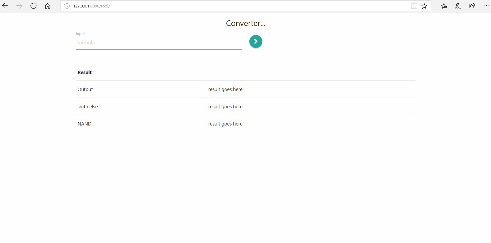

## Project title
The project is about creating a flexible web tool for converting a formula into an evaluating and normalizing, binary tree, parsing the formula, truth table and so on. 

## Motivation
The project exists with the sole purpose of learning and achieving goals of ale1, class at Fontys Hogeschole Eindhoven.

## Build status
Build version Final

## Screenshots

## Tech/framework used
- Langauge: Python 3.7.0
- Framework: Django

<b>Built with</b>
- [PyCharm](https://www.jetbrains.com/pycharm/)

## Features
The selling point of this version of the project is the inclusion of Django. Django helps with developing a cross platform web application that can be used on every device.
The application converts a logical expression in prefix to infix and python Boolean, creates a truth table for the statement and a simplified version of the truth table, creates a graphical representation of the expression and shows the binary and hexadecimal of the expression!

## Installation
- [Python](https://www.python.org/downloads/release/python-370/)
- [Django](https://docs.djangoproject.com/en/2.1/topics/install/)

## Legend
- For Implication instead of (A?B) use >(A, B);
- For XNOR instead of (A?B) use =(A, B);
- For Logical OR instead of (A?B) use |(A, B);
- For Logical AND instead of (A?B) use &(A, B);

## How to use?
Pre requisites are:
* Python
* Django
If Django and python are installed, the only action necessary is to open a cmd in the root folder of the Django project, in this case project folder(containing the readme.md, tool, static and etcetera). Then enter command ’python manage.py runserver’. This is to make a local server for the project, http://127.0.0.1:8000 is the address that the website can be viewed.
If none are installed, http://206.189.10.159 .The only issue with this version is that due to some permission issues for generating the graph, it has been excluded from the final version and can be tested by following the instructions from ‘Tests and graph instructions’ file.

Note: The serve is not running!!
## Contribute
Rostislav Tinchev 358097
